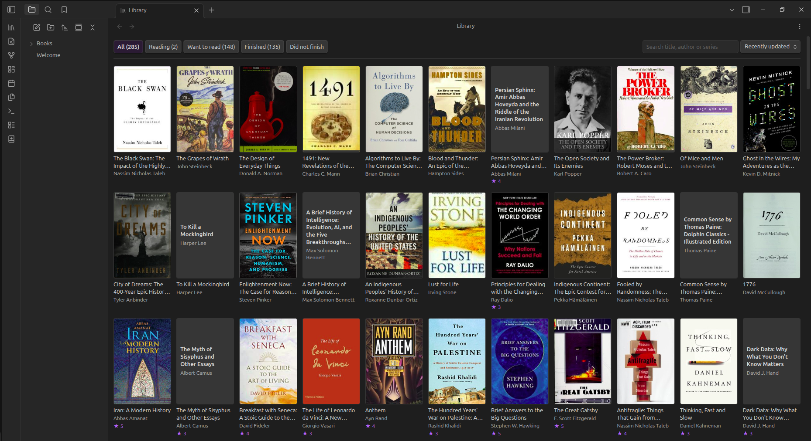
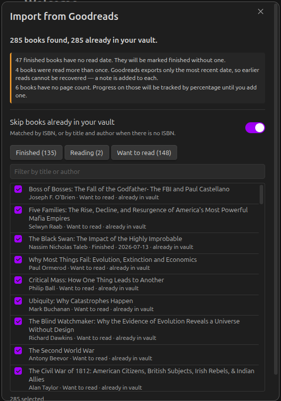
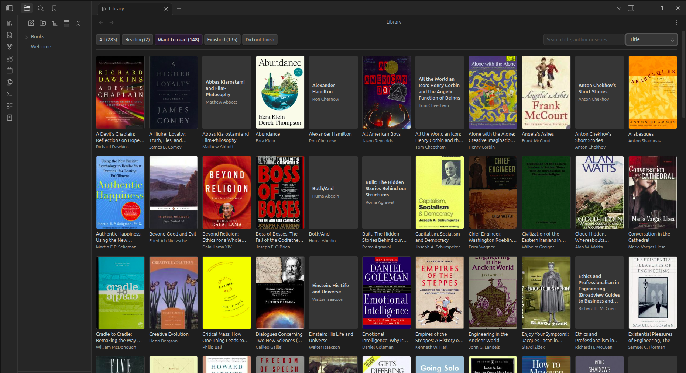
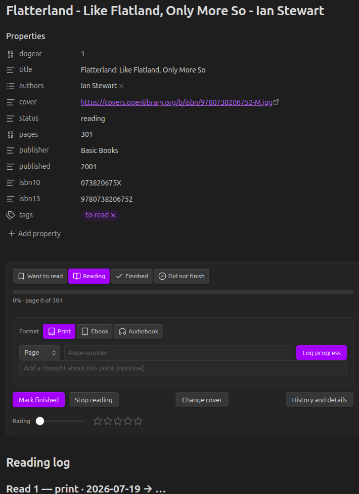
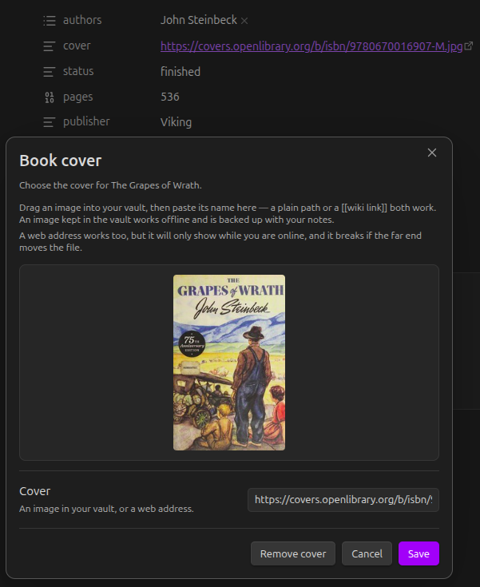
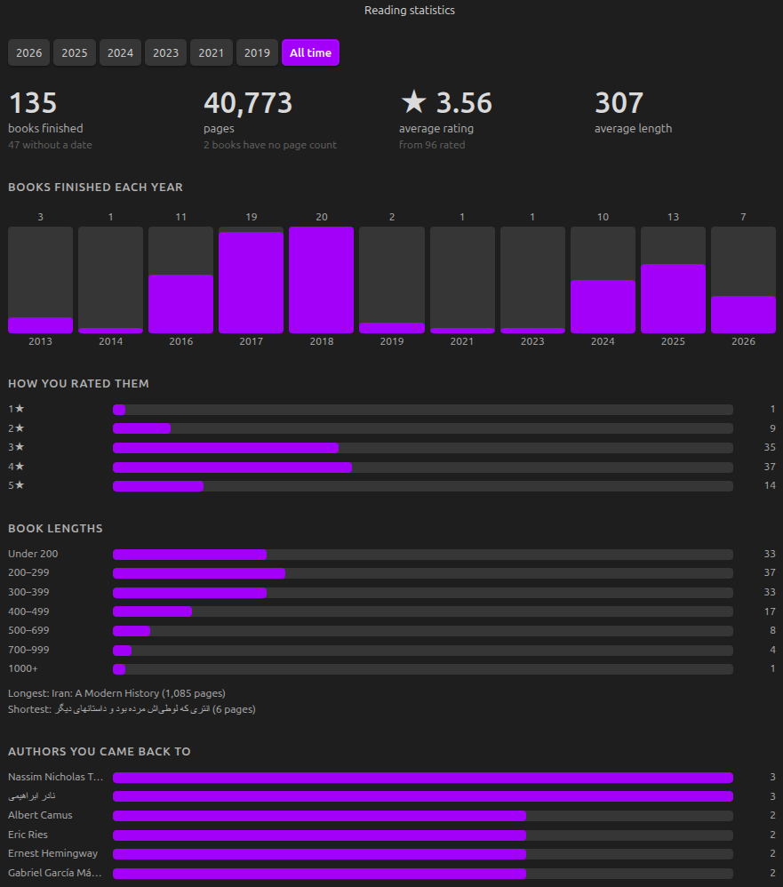

# Dogear

A reading tracker that lives in your vault. Bring your library across from Goodreads, log what you read, and keep it all in plain Markdown you own.



---

## Why

Reading trackers hold your history hostage. Dogear keeps one Markdown note per book, metadata in frontmatter, a reading log in the body, so your library is searchable, linkable, backed up with everything else, and readable in a plain text editor twenty years from now.

It tracks reading. Not ownership, not shelf locations, not friends' feeds.

## Features

### Bring your Goodreads library with you

Export your library from Goodreads and import the CSV. Shelves become
statuses, ratings and read dates carry over, and your reviews and private
notes are kept as prose in each note.

You see exactly what will be created, and can deselect anything, before a single file is written. Where the export is lossy, Dogear says so rather than inventing history: Goodreads records only one date even for a book you read four times, and that is stated plainly instead of fabricated.



### Your library, as a library

A cover grid of everything you have, filtered by shelf, searchable by title, author or series. Books in progress show how far through you are.



### Track progress however you actually read

Log by page, by percentage, by time elapsed, or by time remaining**, which is how audiobook apps report position and how nobody else lets you record it. Everything is normalised to a percentage so progress stays comparable when you switch between a paperback and an audiobook mid-book.



**NOTE:**
For time tracking, the property you need is:

```yaml
duration: 8:42
```
The `Elapsed` and `Remaining` only appear once the book has a `duration`. If the property doesn't exist, the audiobook format falls back to `Percent`, which always works.

The exact rule:

| Format | Units offered |
| --- | --- |
| Print / Ebook | `Page` (if `pages` is set), `Percent` |
| Audiobook | `Percent`, plus `Remaining` and `Elapsed` **if `duration` is set** |

**Accepted formats for `duration`** (all of these parse):

| You type | Means |
| --- | --- |
| `8:42` | 8 hours 42 minutes |
| `8:42:30` | 8 h 42 m 30 s |
| `8h 42m` | same |
| `1h30m` | 1 h 30 m |
| `45m` | 45 minutes |
| `90` | a bare number is **minutes**, so 1 h 30 m |

It's normalised to `H:MM` on save, so `8h 42m` becomes `8:42`.

### Find books without leaving your vault

Search across Open Library, Google Books, the Library of Congress and the Internet Archive, with automatic fallback when one is unavailable. Requests are rate limited on your side, so limits are respected rather than discovered.

Metadata lookup is enrichment, never a prerequisite, adding a book by hand always works, offline and forever.


### Covers, including the ones no catalogue has

Covers come from Open Library, whose collection is good but far from complete; books in non-Latin scripts, small presses and older translations are often missing. Any image in your vault can be used instead, which works offline and is backed up with your notes. Covers can also be downloaded into the vault in bulk so they keep working without a connection.



### Statistics worth reading

Books and pages finished, how you rated them, how long they were, and which authors you returned to, by year or across everything. Audiobooks are counted in hours rather than pages (if the correct property was included in the entry), so listening is not quietly excluded.

Deliberately small: every figure works from a finish date, a rating and a page count, because that is all an imported library knows. No mood tracking, no genre charts, no streaks.



## Installing

**From Obsidian.** Settings → Community plugins → Browse → search for "Dogear" → Install → Enable.

**Manually.** Download `main.js`, `manifest.json` and `styles.css` from the [latest release](https://github.com/MasoudMiM/obsidian-dogear/releases/latest) into `VaultFolder/.obsidian/plugins/dogear/`, then enable it under Settings → Community plugins.

## Getting started

1. **Coming from Goodreads?** On Goodreads, go to My Books → Import and Export → Export Library. The file arrives by email within a few minutes. Then run **Import from Goodreads** from the command palette.
2. **Starting fresh?** Run **Add a book**, search for a title, and pick it.
3. Open your library from the ribbon icon, or **Open your library**.

Every action is available from the command palette and from the panel inside each book note, so nothing is buried.

| Command | What it does |
| --- | --- |
| Open your library | The cover grid |
| Reading statistics | Your reading, by year |
| Add a book | Search the metadata sources |
| Add a book manually | No network required |
| Update reading progress | Log a position |
| Set the cover for this book | Use an image from your vault |
| Download covers into the vault | Make covers work offline |
| Add missing covers | Fill in covers from ISBNs |
| Import from Goodreads | Bring your library across |

## How your data is stored

One note per book:

```markdown
---
dogear: 1
title: The Power Broker
authors:
  - Robert A. Caro
isbn13: "9780394480763"
pages: 1246
status: finished
rating: 5
---

## Reading log

### Read 1 — print · 2024-01-04 → 2024-03-12

- 2024-01-14 · page 210 · 17%
- 2024-02-02 · page 604 · 48%

## Notes

Anything you write here is yours, and Dogear will never touch it.
```

Nothing is hidden in a database. Your reading log is readable text, your own notes are preserved exactly as written, and if you uninstall Dogear tomorrow you still have every book.

## Settings

Choose where book notes live and how they are named, which heading holds the reading log, your default format, which metadata sources to use and in what order, and where downloaded covers are kept.

## Data sources and attribution

Book metadata comes from [Open Library](https://openlibrary.org), [Google Books](https://books.google.com), the [Library of Congress](https://www.loc.gov) and the [Internet Archive](https://archive.org). Cover images come from Open Library.

Dogear ships no API key and runs no proxy: requests go from your machine to those services directly. Rate limits are respected on the client side, and bulk cover downloading is opt-in and deliberately slow, in keeping with Open Library's request that its cover service not be used for bulk downloads.

## Contributing

Issues and pull requests are welcome.

```bash
npm install
npm test     # 1,191 tests
npm run dev  # watch build
```

The logic layer imports neither the DOM nor the Obsidian API, so it can be
tested directly; anything touching the interface lives in `src/ui/`.

## Roadmap

See [ROADMAP.md](ROADMAP.md).

## Licence

[MIT](LICENSE) © Masoud Masoumi
